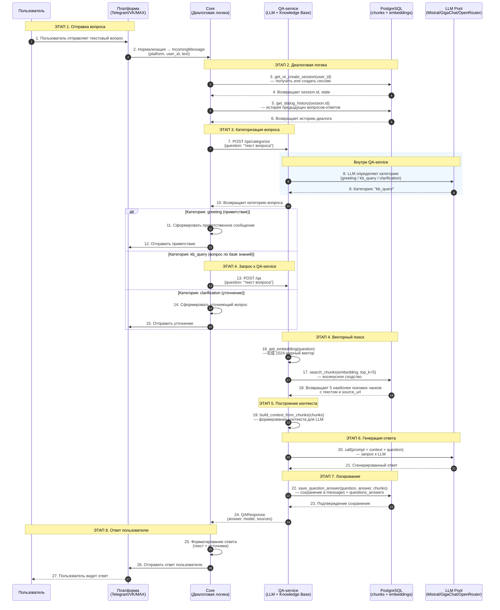

# Пользовательский пайплайн: Вопрос пользователя → Ответ бота

## Общее описание

Данный документ описывает полный путь запроса пользователя от отправки сообщения до получения ответа от LLM с использованием базы знаний ТюмГУ.

---

### Mermaid диаграмма: полный сценарий вопроса



---

### Детализация по каждому этапу

#### ЭТАП 1: Отправка вопроса пользователем

**Участники:** Пользователь → Платформа

**Описание:**
Пользователь отправляет текстовый вопрос через интерфейс мессенджера (Telegram, VK или MAX). Платформа преобразует сообщение в единый формат `IncomingMessage`.

**Что происходит:**
1. Пользователь пишет вопрос, например: "Какие правила приёма в магистратуру?"
2. Платформа (Telegram Bot API / VK API / MAX API) получает событие Message
3. Адаптер платформы вызывает `normalize_message()` → преобразует в единый формат

**Результат:**
- `IncomingMessage` содержит: `platform`, `user_id`, `chat_id`, `text`, `message_id`

---

#### ЭТАП 2: Диалоговая логика в Core

**Участники:** Core → PostgreSQL

**Описание:**
Core-сервис обрабатывает диалоговую логику: проверяет/создаёт сессию пользователя, загружает историю предыдущих вопросов-ответов для контекста.

**Что происходит:**
1. `get_or_create_session(user_id)` — проверяет есть ли сессия в таблице `sessions`, если нет — создаёт новую
2. `get_dialog_history(session.id)` — загружает последние N вопросов-ответов из таблицы `questions_answers`
3. Формируется контекст диалога: "Q: предыдущий вопрос\nA: предыдущий ответ\nQ: текущий вопрос"

**Результат:**
- Сессия пользователя
- История диалога для контекста

---

#### ЭТАП 3: Категоризация вопроса

**Участники:** Core → QA → LLM

**Описание:**
QA-service определяет тип вопроса с помощью LLM, чтобы выбрать правильную стратегию ответа.

**Что происходит:**
1. Core отправляет вопрос в `/qa/categorize`
2. LLM анализирует вопрос и определяет категорию:
   - `greeting` — приветствие, smalltalk
   - `kb_query` — вопрос по базе знаний ТюмГУ
   - `clarification` — непонятно, нужно уточнить

**Результат:**
- Категория вопроса определяет дальнейший путь обработки

---

#### ЭТАП 4: Векторный поиск в базе знаний

**Участники:** QA → PostgreSQL

**Описание:**
QA-service выполняет семантический поиск по базе знаний с использованием эмбеддингов.

**Что происходит:**
1. `get_embedding(question)` — модель `deepvk/USER-bge-m3` преобразует текст вопроса в 1024-мерный вектор
2. `search_chunks(embedding, top_k=5)` — выполняет косинусное сходство между вектором вопроса и векторами чанков в таблице `embeddings`
3. Возвращает top 5 наиболее релевантных чанков с текстом и source_url

**Результат:**
- Список из 5 чанков с текстом и метаданными (source_url, title)

**SQL запрос:**
```sql
SELECT c.id, c.text, c.title, c.source_url, e.embedding
FROM chunks c
JOIN embeddings e ON c.id = e.chunk_id
ORDER BY e.embedding <=> query_embedding
LIMIT 5;
```

---

#### ЭТАП 5: Построение контекста для LLM

**Участники:** QA (внутри сервиса)

**Описание:**
Из найденных чанков формируется контекст, который будет передан в промпт LLM.

**Что происходит:**
1. `build_context_from_chunks(chunks)` — преобразует каждый чанк в формат:
   ```
   --- Документ 1 ---
   Источник: https://...
   Название: Правила приёма
   Содержание: текст чанка...
   ```
2. Все чанки объединяются в один контекст

**Результат:**
- Текст контекста для LLM (до ~5000 символов)

---

#### ЭТАП 6: Генерация ответа LLM

**Участники:** QA → LLM Pool

**Описание:**
Сформированный промпт (System Prompt + Контекст из БЗ + Вопрос пользователя) отправляется в LLM Pool.

**Что происходит:**
1. Формируется финальный промпт:
   ```
   SYSTEM_PROMPT: Ты — виртуальный помощник студента ТюмГУ...
   
   Контекст из документов ТюмГУ:
   --- Документ 1 ---
   Источник: https://sveden.utmn.ru/...
   Название: Правила приёма
   Содержание: ...
   
   Вопрос: Какие правила приёма в магистратуру?
   ```
2. LLM Pool выбирает доступный провайдер (Mistral → GigaChat → OpenRouter)
3. LLM генерирует ответ на русском языке

**Результат:**
- Сгенерированный текстовый ответ
- Использованная модель (например, "mistral")

---

#### ЭТАП 7: Логирование в БД

**Участники:** QA → PostgreSQL

**Описание:**
Вопрос и ответ сохраняются в БД для истории и анализа.

**Что происходит:**
1. Сохранение вопроса: `INSERT INTO messages (session_id, role, content)`
2. Сохранение ответа: `INSERT INTO messages (session_id, role, content, model_used)`
3. Связывание: `INSERT INTO questions_answers (question_id, answer_id)`

**Результат:**
- История диалога сохранена в БД

---

#### ЭТАП 8: Отправка ответа пользователю

**Участники:** Core → Платформа → Пользователь

**Описание:**
Сформированный ответ отправляется пользователю через платформу.

**Что происходит:**
1. Core получает `QAResponse` от QA-service
2. Форматирует ответ: добавляет источники в виде "Источник: [название](URL)"
3. `denormalize_response()` — преобразует в формат платформы
4. Отправляет сообщение через API платформы
5. Пользователь видит ответ

**Результат:**
- Пользователь получает ответ на свой вопрос

---

## Дополнительные возможности

### Оценка ответа

После получения ответа пользователь может оценить его (кнопки 1-5). Оценка сохраняется в БД и используется для:
- Улучшения качества ответов
- Кэширования высоко оценённых ответов (score = 5)

### Кэширование ответов

При оценке ответа 5 баллов:
1. LLM генерирует эмбеддинг ответа
2. Эмбеддинг сохраняется в таблице `questions_answers.embedding`
3. При похожем вопросе LLM Pool сначала ищет в кэше и использует сохранённый ответ без повторного вызова LLM

---

## Таблицы базы данных

| Таблица | Назначение |
|---------|------------|
| `users` | Пользователи платформ |
| `sessions` | Сессии диалогов |
| `messages` | Все сообщения (вопросы и ответы) |
| `questions_answers` | Связь вопрос-ответ |
| `chunks` | Текстовые чанки из документов |
| `embeddings` | Векторные представления чанков |

---

## API Endpoints

| Метод | Путь | Назначение |
|-------|------|------------|
| POST | /qa | Основной endpoint для вопросов |
| POST | /qa/categorize | Определение типа вопроса |
| GET | /health | Проверка здоровья сервиса |
| GET | /kb/chunks | Просмотр чанков (для админки) |

---

## Технологический стек

| Компонент | Технология |
|-----------|------------|
| Backend | Python 3.12, FastAPI |
| Database | PostgreSQL + pgvector |
| Embeddings | deepvk/USER-bge-m3 |
| LLM Pool | Mistral, GigaChat, OpenRouter |
| OCR | Tesseract |
| Containerization | Docker, Docker Compose |
