# Пользовательский пайплайн: Вопрос пользователя → Ответ бота

## Общее описание

Данный документ описывает полный путь запроса пользователя от отправки сообщения в мессенджере до получения ответа от LLM с использованием базы знаний ТюмГУ.

---

### Mermaid диаграмма: полный сценарий вопроса

```mermaid
sequenceDiagram
    autonumber
    
    participant User as Пользователь
    participant Platform as Платформа<br/>(Telegram/VK/MAX API)
    participant Adapter as Platform Adapter<br/>(bots/telegram/bot.py)
    participant CoreClient as CoreClient<br/>(httpx)
    participant Core as bot-core<br/>(FastAPI)
    participant BotService as BotService<br/>(services/bot_service.py)
    participant UserService as UserService<br/>(services/user_service.py)
    participant QAClient as QAServiceClient<br/>(services/qa_service_client.py)
    participant QA as qa-service<br/>(FastAPI)
    participant LightRAG as LightRAG<br/>(lightrag.py)
    participant Embedding as Embedding<br/>(kb/embedding.py)
    participant PGVector as PGVectorStorage<br/>(vectors)
    participant PGGraph as PGGraphStorage<br/>(knowledge graph)
    participant ClassicSearch as Classic Search<br/>(kb/search.py)
    participant LLMPool as LLM Pool<br/>(llm/pool.py)
    participant Mistral as Mistral<br/>(API)
    participant GigaChat as GigaChat<br/>(API)
    participant OpenRouter as OpenRouter<br/>(API)
    participant DB_Postgres as PostgreSQL<br/>(pgvector + AGE)
    participant PlatformOut as Platform API
    participant UserResult as Пользователь

    %% ЭТАП 1: Отправка вопроса
    Note over User,Platform: === ЭТАП 1: Пользователь отправляет вопрос ===
    User->>Platform: 1. Текстовый вопрос<br/>("Какие правила приёма в магистратуру?")
    Platform->>Adapter: 2. Событие Message

    %% ЭТАП 2: Нормализация
    Note over Adapter,CoreClient: === ЭТАП 2: Нормализация и отправка в Bot-Core ===
    Adapter->>Adapter: 3. detect_message_type()<br/>(text/voice/sticker/photo...)
    Adapter->>Adapter: 4. _build_payload() → IncomingMessage
    rect dashed
        Note over Adapter: IncomingMessage JSON:<br/>{platform, user_id, chat_id,<br/>text, message_type, metadata}
    end
    Adapter->>CoreClient: 5. POST /messages (json payload)
    CoreClient->>Core: 6. HTTP POST /messages

    %% ЭТАП 3: Bot-Core приём
    Note over Core,BotService: === ЭТАП 3: Приём и маршрутизация ===
    Core->>Core: 7. POST /messages endpoint<br/>(FastAPI route)
    Core->>BotService: 8. handle_message(IncomingMessage)

    %% ЭТАП 4: UserService - upsert
    Note over BotService,DB_Postgres: === ЭТАП 4: Работа с пользователем ===
    BotService->>UserService: 9. upsert_user(message)
    UserService->>DB_Postgres: 10. SELECT * FROM users<br/>WHERE platform=? AND platform_user_id=?

    alt Пользователь НЕ найден
        DB_Postgres-->>UserService: 11. None
        UserService->>DB_Postgres: 12. INSERT INTO users (...)
        DB_Postgres-->>UserService: 13. COMMIT + user.id
    else Пользователь найден
        DB_Postgres-->>UserService: 14. User object
        UserService->>DB_Postgres: 15. UPDATE users SET ...<br/>(username, first_name, last_name)
        DB_Postgres-->>UserService: 16. COMMIT
    end
    UserService-->>BotService: 17. User object

    %% ЭТАП 5: Маршрутизация по типу
    Note over BotService,QAClient: === ЭТАП 5: Маршрутизация текстового сообщения ===
    BotService->>BotService: 18. Проверка message_type
    
    alt message_type == "text"
        BotService->>BotService: 19. _handle_text_message()
        BotService->>BotService: 20. normalize_text = text.strip().lower()
        
        alt normalize_text == "/start"
            BotService->>BotService: 21. _build_start_response()<br/>(приветствие + кнопки)
        else normalize_text == "/ping"
            BotService->>BotService: 22. reply_text = "pong"
        else ЛЮБОЙ текст → QA
            BotService->>QAClient: 23. ask(question)
        end
        
    else message_type == "voice"
        BotService->>BotService: 24. _handle_voice_message()<br/>(заглушка)
    else Другой тип
        BotService->>BotService: 25. _build_unsupported_message_response()
    end

    %% ЭТАП 6: QAServiceClient → QA (с retry)
    Note over QAClient,QA: === ЭТАП 6: Отправка в QA-Service (retry логика) ===
    loop Retry (max 3, backoff: 1→2→4→8s)
        QAClient->>QA: 26. POST /qa {question: "..."}
        
        alt Успех (200)
            QA-->>QAClient: 27. {answer, model, sources}
        else Ошибка (503/500/429/timeout)
            QA--xQAClient: 28. HTTP Error
            QAClient->>QAClient: 29. time.sleep(backoff)<br/>(exponential backoff)
        end
    end

    %% ЭТАП 7: QA-Service → LightRAG (primary) или Classic RAG (fallback)
    Note over QA,LightRAG: === ЭТАП 7: QA-Service обработка (LightRAG → Fallback) ===
    QA->>QA: 30. ask_question(QARequest)
    QA->>QA: 31. USE_LIGHT_RAG = os.getenv("USE_LIGHT_RAG")
    
    alt USE_LIGHT_RAG == "true"
        Note over QA,LightRAG: --- Попытка LightRAG (timeout 20s) ---
        QA->>LightRAG: 32. aquery(question, param=QueryParam(mode="mix"))
        
        rect dashed
            Note over LightRAG: LightRAG Query Flow:<br/>1. Keyword extraction<br/>2. Vector search (PGVector)<br/>3. Graph search (PGGraph)<br/>4. Full-text search<br/>5. Merge results (ranked)
        end
        
        LightRAG->>Embedding: 33. embedding_func(question)<br/>(deepvk/USER-bge-m3)
        Embedding->>LightRAG: 34. 1024-dim vector
        
        LightRAG->>PGVector: 35. similarity_search(vector, top_k)
        PGVector->>DB_Postgres: 36. SELECT ... ORDER BY vector <=> query
        DB_Postgres-->>PGVector: 37. Top-K chunks (text, source_url)
        PGVector-->>LightRAG: 38. vector_results
        
        LightRAG->>PGGraph: 39. graph_lookup(keywords)
        PGGraph->>DB_Postgres: 40. MATCH (n)-[r]->(m)<br/>WHERE n.name IN keywords
        DB_Postgres-->>PGGraph: 41. Graph entities + relations
        PGGraph-->>LightRAG: 42. graph_results
        
        LightRAG->>LightRAG: 43. merge_and_rank(<br/>vector_results,<br/>graph_results)
        LightRAG->>LLMPool: 44. llm_model_func(prompt + context)
        
        alt LightRAG успех (< 20s)
            LLMPool-->>LightRAG: 45. LLMResponse (content)
            LightRAG-->>QA: 46. answer_text
            
        else LightRAG timeout или ошибка
            LightRAG--xQA: 47. TimeoutError / Exception
            Note over QA,ClassicSearch: --- Fallback: Classic RAG (timeout 15s) ---
            
            QA->>ClassicSearch: 48. get_embedding(question)
            ClassicSearch->>Embedding: 49. model.encode(text)
            Embedding->>ClassicSearch: 50. embedding = [0.123, ...]
            
            ClassicSearch->>DB_Postgres: 51. SELECT ... FROM chunks c<br/>JOIN embeddings e ON c.id = e.chunk_id<br/>ORDER BY e.embedding_vector <=> :embedding<br/>LIMIT 3
            DB_Postgres-->>ClassicSearch: 52. Top-3 chunks
            ClassicSearch-->>QA: 53. chunks = [{text, title, source_url}, ...]
            
            QA->>QA: 54. build_context_from_chunks(chunks)
            QA->>QA: 55. prompt = SYSTEM_PROMPT_WITH_CONTEXT<br/>+ context + question
            
            QA->>LLMPool: 56. llm_pool.call(prompt)
        end
        
    else USE_LIGHT_RAG != "true"
        Note over QA,ClassicSearch: --- Classic RAG only ---
        QA->>ClassicSearch: 57. get_embedding(question)
        ClassicSearch->>DB_Postgres: 58. Vector search (top_k=3)
        DB_Postgres-->>ClassicSearch: 59. chunks
        ClassicSearch-->>QA: 60. chunks
        QA->>QA: 61. build_context_from_chunks(chunks)
        QA->>LLMPool: 62. llm_pool.call(prompt)
    end

    %% ЭТАП 8: LLM Pool
    Note over LLMPool,OpenRouter: === ЭТАП 8: LLM Pool (fallback: mistral → gigachat → openrouter) ===
    loop По приоритету: mistral → gigachat → openrouter
        LLMPool->>LLMPool: 63. select_model()
        LLMPool->>LLMPool: 64. get_available_providers()
        
        alt Mistral доступен
            LLMPool->>Mistral: 65. POST /v1/chat/completions
            Mistral-->>LLMPool: 66. {choices: [{message: {content: "..."}}]}
        else Mistral недоступен
            alt GigaChat доступен
                LLMPool->>GigaChat: 67. POST /llm/v1/chat/completions
                GigaChat-->>LLMPool: 68. Response JSON
            else GigaChat недоступен
                LLMPool->>OpenRouter: 69. POST /v1/chat/completions
                OpenRouter-->>LLMPool: 70. Response JSON
            end
        end
    end
    
    LLMPool-->>QA: 71. LLMResponse(content, model, usage)

    %% ЭТАП 9: Формирование QAResponse
    Note over QA,QAClient: === ЭТАП 9: Формирование ответа ===
    QA->>QA: 72. Формирование QAResponse
    alt chunks найдены
        QA->>QA: 73. sources = [c.source_url for c in chunks]
    else
        QA->>QA: 74. sources = []
    end
    QA-->>QAClient: 75. QAResponse {answer, model, sources}

    %% ЭТАП 10: Возврат в Bot-Service
    Note over QAClient,BotService: === ЭТАП 10: Возврат ответа ===
    QAClient-->>BotService: 76. reply_text = answer

    %% ЭТАП 11: BotResponse
    Note over BotService,PlatformOut: === ЭТАП 11: Формирование BotResponse ===
    BotService->>BotService: 77. _build_feedback_buttons()<br/>(["👍", "👎"])
    BotService->>BotService: 78. BotResponse(actions=[<br/>OutgoingAction(send_text, text, buttons)<br/>])

    %% ЭТАП 12: Отправка на платформу
    Note over PlatformOut,UserResult: === ЭТАП 12: Доставка ответа пользователю ===
    BotService->>Core: 79. BotResponse JSON
    Core-->>Adapter: 80. Response JSON
    Adapter->>Adapter: 81. build_inline_keyboard(buttons)
    Adapter->>PlatformOut: 82. sendMessage(text, reply_markup)
    PlatformOut-->>UserResult: 83. Пользователь получает ответ<br/>с кнопками 👍/👎

    %% Альтернативные пути
    alt normalize_text == "/start"
        BotService->>BotService: 84. _build_start_buttons(is_subscribed)
    end

    %% Обработка ошибок
    alt Ошибка QAServiceTimeout
        BotService->>BotService: 85. "Поиск ответа занимает дольше обычного..."
    else Ошибка QAServiceUnavailable
        BotService->>BotService: 86. "Сервис временно недоступен..."
    else Ошибка QAServiceError
        BotService->>BotService: 87. "Не удалось сформировать ответ..."
    end
```



---

### Детализация по каждому этапу

#### ЭТАП 1: Отправка вопроса пользователем (Platform Input)

**Участники:** Пользователь → Платформа (Telegram/VK/MAX)

**Описание:**
Пользователь отправляет текстовый вопрос через интерфейс мессенджера. Платформа генерирует событие `Message`.

**Реализация:**
- **Telegram**: `aiogram` Bot → Dispatcher → `handle_message()`
- **VK**: Аналогичный адаптер
- **MAX**: Go-сервис с аналогичной логикой

**Что происходит:**
1. Пользователь пишет вопрос: "Какие правила приёма в магистратуру?"
2. Платформа (Telegram Bot API / VK API / MAX API) получает событие `Message`
3. Адаптер определяет тип сообщения через `detect_message_type()`:
   - `text` — текстовое сообщение
   - `voice` — голосовое сообщение
   - `sticker`, `photo`, `video`, `audio`, `document` — медиа
4. Адаптер преобразует в единый формат через `_build_payload()`:

```python
{
    "platform": "telegram",
    "message_type": "text",
    "user_id": "123456789",
    "chat_id": "123456789",
    "text": "Какие правила приёма в магистратуру?",
    "message_id": "42",
    "timestamp": "2024-01-15T10:30:00Z",
    "metadata": {
        "username": "student",
        "first_name": "Иван",
        "last_name": "Иванов",
        "chat_type": "private"
    }
}
```

**Результат:**
- `IncomingMessage` — нормализованное сообщение

---

#### ЭТАП 2: Normalize и отправка в Bot-Core (Platform Adapter)

**Участники:** Platform Adapter → CoreClient

**Описание:**
Адаптер платформы отправляет нормализованное сообщение в bot-core через HTTP.

**Реализация (`bots/telegram/bot.py`):**
```python
class CoreClient:
    async def process_message(self, message: Message) -> dict[str, Any]:
        payload = self._build_payload(message)
        response = await self._client.post("/messages", json=payload)
        return response.json()
```

**Что происходит:**
1. `CoreClient.process_message()` отправляет POST запрос на `/messages`
2. Показывает "Ищу ответ на ваш вопрос..." (pending message) для текстовых сообщений кроме `/start` и `/ping`
3. Обрабатывает ошибки: HTTP 503, 500, таймауты

**Результат:**
- HTTP запрос к bot-core с нормализованным JSON

---

#### ЭТАП 3: Приём и маршрутизация в Bot-Core (API)

**Участники:** Bot-Core FastAPI → BotService

**Описание:**
Bot-Core принимает сообщение и передаёт в бизнес-логику.

**Реализация (`core/services/bot_service.py`):**
```python
def handle_message(self, message: IncomingMessage) -> BotResponse:
    user = self._user_service.upsert_user(message)
    
    if message.message_type == "text":
        return self._handle_text_message(message, user)
    if message.message_type == "voice":
        return self._handle_voice_message(message)
    return self._build_unsupported_message_response(message)
```

**Что происходит:**
1. Принимает POST на `/messages` с нормализованным JSON
2. Создаёт/обновляет пользователя через `UserService.upsert_user()`
3. Маршрутизирует по типу сообщения:
   - `text` → `_handle_text_message()`
   - `voice` → `_handle_voice_message()`
   - другие → `_build_unsupported_message_response()`

**UserService.upsert_user():**
```python
def upsert_user(self, message: IncomingMessage) -> User | None:
    # SELECT * FROM users WHERE platform = ? AND platform_user_id = ?
    user = session.query(User).filter(...).one_or_none()
    
    if user is None:
        # INSERT INTO users (...)
        user = User(platform=..., platform_user_id=...)
    else:
        # UPDATE users SET ...
        user.username = metadata.get("username")
    
    session.commit()
```

**Результат:**
- Пользователь сохранён/обновлён в БД
- Маршрутизация на обработчик

---

#### ЭТАП 4: Обработка текстового сообщения

**Участники:** BotService → QAServiceClient

**Описание:**
Обработка текстового сообщения, включая команды и вопросы к QA-сервису.

**Реализация (`_handle_text_message`):**
```python
def _handle_text_message(self, message: IncomingMessage, user) -> BotResponse:
    normalized_text = (message.text or "").strip()
    lowered_text = normalized_text.lower()

    if lowered_text == "/start":
        return self._build_start_response(message, user)
    if lowered_text == "/ping":
        reply_text = "pong"
    else:
        reply_text = self._ask_qa_service(normalized_text)

    return BotResponse(actions=[
        OutgoingAction(type=ActionType.send_text, text=reply_text,
                       buttons=self._build_feedback_buttons())
    ])
```

**Обрабатываемые команды:**
- `/start` — приветствие с inline кнопками "Начать новый диалог" и "Подписаться/Отписаться"
- `/ping` — возвращает "pong"
- любой другой текст → отправка в QA-сервис

**Голосовые сообщения (`_handle_voice_message`):**
```python
return BotResponse(actions=[
    OutgoingAction(
        type=ActionType.send_text,
        text="Я получил голосовое сообщение. Скоро здесь будет распознавание речи."
    )
])
```

**Результат:**
- Текст ответа для отправки пользователю
- Кнопки feedback (like/dislike) — **реализованы, но обработчики не подключены**

---

#### ЭТАП 5: Отправка в QA-Service (QAServiceClient)

**Участники:** QAServiceClient (Retry Logic)

**Описание:**
Клиент отправляет вопрос в QA-сервис с логикой повторных попыток.

**Реализация (`services/qa_service_client.py`):**
```python
class QAServiceClient:
    MAX_RETRIES = 3
    INITIAL_BACKOFF = 1.0
    MAX_BACKOFF = 8.0

    def ask(self, question: str, context: str | None = None) -> str:
        for attempt in range(self._max_retries):
            try:
                response = self._client.post("/qa", json={
                    "question": question,
                    "context": context,
                })
                
                # Retry на 503, 500, timeout, 429
                # ОбрабатываетConnectError
                
                response.raise_for_status()
                return response.json()["answer"]
            except Exception as e:
                # Логирование + backoff
                time.sleep(backoff)
                backoff = min(backoff * 2, MAX_BACKOFF)
        
        raise last_error
```

**Логика retry:**
- **503 (Unavailable)**: Exponential backoff, до 3 попыток
- **500 (Internal Error)**: Exponential backoff
- **429 (Rate Limited)**: Увеличенный backoff (x2)
- **Timeout**: Exponential backoff
- **Connect Error**: Exponential backoff

**Результат:**
- Ответ от QA-сервиса или исключение (`QAServiceTimeout`, `QAServiceUnavailable`, `QAServiceError`)

---

#### ЭТАП 6: Обработка вопроса в QA-Service (QA API)

**Участники:** QA FastAPI → LightRAG → Embedding → PGVector/PGGraph → LLM Pool

**Описание:**
QA-service получает вопрос и использует **LightRAG** как primary метод с fallback на **Classic RAG**.

**Реализация (`api/routes/qa.py`):**
```python
@router.post("", response_model=QAResponse)
async def ask_question(request: QARequest) -> QAResponse:
    """Основной endpoint: LightRAG (primary) + Classic RAG (fallback)."""
    use_lightrag = True  # Можно управлять через USE_LIGHT_RAG env var

    if use_lightrag:
        try:
            # Попытка LightRAG (timeout: 20s)
            result = await asyncio.wait_for(
                _query_lightrag(request.question),
                timeout=LIGHTRAG_TIMEOUT_SECONDS
            )
            return result
        except (asyncio.TimeoutError, Exception) as e:
            # Fallback на Classic RAG (timeout: 15s)
            return await asyncio.wait_for(
                _query_classic_rag(request.question),
                timeout=CLASSIC_RAG_TIMEOUT_SECONDS
            )
```

**Конфигурация:**

| Параметр | Значение | Описание |
|----------|----------|----------|
| LIGHTRAG_TIMEOUT_SECONDS | 20 | Timeout для LightRAG |
| CLASSIC_RAG_TIMEOUT_SECONDS | 15 | Timeout для Classic RAG fallback |

**LightRAG Query Flow:**

1. **Keyword extraction** - извлечение ключевых слов из вопроса
2. **Vector search** - поиск в PGVectorStorage (embedding similarity)
3. **Graph search** - поиск в PGGraphStorage (relations между сущностями)
4. **Full-text search** - дополнительный текстовый поиск
5. **Merge & Rank** - объединение и ранжирование результатов
6. **LLM generation** - генерация ответа через LLM Pool

**Storage:**

- **PGVectorStorage**: Хранение векторов (chunk_id → embedding)
- **PGGraphStorage**: Хранение графа знаний (entities + relations) - требует Apache AGE
- Fallback: **NetworkXStorage** если PGGraph недоступен

**Fallback логика:**

```
LightRAG (20s) → [timeout/error] → Classic RAG (15s) → [timeout/error] → Error Response
```

**Результат:**
- `QAResponse` с answer, model, sources

---

#### ЭТАП 7: Генерация эмбеддинга

**Участники:** Embedding Model (sentence-transformers)

**Описание:**
Текст вопроса преобразуется в 1024-мерный вектор для семантического поиска.

**Реализация (`kb/embedding.py`):**
```python
_model: Optional[SentenceTransformer] = None

def get_embedding_model() -> SentenceTransformer:
    global _model
    if _model is None:
        config = get_kb_config()
        _model = SentenceTransformer(config.embedding_model)  # deepvk/USER-bge-m3
    return _model

def get_embedding(text: str) -> list[float]:
    model = get_embedding_model()
    embedding = model.encode(text, normalize_embeddings=True)
    return embedding.tolist()  # 1024-мерный вектор
```

**Модель:** `deepvk/USER-bge-m3` (1024 dimensions)

**Результат:**
- Нормализованный вектор (list[float] длиной 1024)

---

#### ЭТАП 8: Векторный поиск в базе знаний

**Участники:** QA → PostgreSQL (pgvector)

**Описание:**
Выполняется семантический поиск по чанкам с использованием косинусного сходства pgvector.

**Реализация (`kb/search.py`):**
```python
async def search_chunks(
    query: str,
    embedding: list[float],
    top_k: int = 5,
) -> list[dict]:
    engine = get_engine()
    embedding_str = "[" + ",".join(map(str, embedding)) + "]"

    with engine.connect() as conn:
        result = conn.execute(text("""
            SELECT 
                c.id, 
                c.text, 
                c.title, 
                c.source_url,
                (e.embedding_vector <=> cast(:embedding as vector)) as similarity
            FROM chunks c
            JOIN embeddings e ON c.id = e.chunk_id
            WHERE e.embedding_vector IS NOT NULL
            ORDER BY e.embedding_vector <=> cast(:embedding as vector)
            LIMIT :top_k
        """), {"embedding": embedding_str, "top_k": top_k})

        chunks = []
        for row in result:
            chunks.append({
                "id": str(row.id),
                "text": row.text,
                "title": row.title,
                "source_url": row.source_url,
                "similarity": float(row.similarity),
            })

    return chunks
```

**SQL запрос:**
```sql
SELECT c.id, c.text, c.title, c.source_url,
       (e.embedding_vector <=> cast(:embedding as vector)) as similarity
FROM chunks c
JOIN embeddings e ON c.id = e.chunk_id
WHERE e.embedding_vector IS NOT NULL
ORDER BY e.embedding_vector <=> cast(:embedding as vector)
LIMIT 3;
```

**Оператор `<=>`**: Косинусное сходство pgvector

**Важно:** В коде используется `top_k=3`, а не 5 как в документации!

**Результат:**
- Список из 3 чанков с текстом, названием, source_url и similarity

---

#### ЭТАП 9: Построение контекста для LLM

**Участники:** QA (build_context_from_chunks)

**Описание:**
Из найденных чанков формируется контекст для промпта LLM.

**Реализация (`kb/search.py`):**
```python
def build_context_from_chunks(chunks: list[dict]) -> str:
    if not chunks:
        return ""

    context_parts = []
    for i, chunk in enumerate(chunks, 1):
        source = chunk.get("source_url", "Unknown")
        title = chunk.get("title", "Untitled")
        text = chunk["text"]

        context_parts.append(
            f"--- Документ {i} ---\n"
            f"Источник: {source}\n"
            f"Название: {title}\n"
            f"Содержание: {text}\n"
        )

    return "\n\n".join(context_parts)
```

**Результат:**
- Текст контекста для LLM, например:
```
--- Документ 1 ---
Источник: https://abiturient.utmn.ru/magistr
Название: Правила приёма в магистратуру
Содержание: При приёме в магистратуру...
```

---

#### ЭТАП 10: Генерация ответа LLM Pool

**Участники:** LLM Pool → Mistral / GigaChat / OpenRouter

**Описание:**
Собранный промпт отправляется в LLM Pool с fallback логикой между провайдерами.

**Реализация (`llm/pool.py`):**
```python
class LLMPool:
    def __init__(self, config: LLMConfig | None = None):
        self._providers = {
            "mistral": MistralProvider(...),
            "openrouter": OpenRouterProvider(...),
            "gigaсhat": GigaChatProvider(...),
        }

    async def call(self, prompt: str, ...) -> LLMResponse:
        available = self.get_available_providers()
        providers_to_try = [p for p in self._config.model_priority if p in available]

        for prov_name in providers_to_try:
            provider = self._providers.get(prov_name)
            try:
                response = await provider.generate(prompt=prompt, ...)
                return response
            except Exception as e:
                continue  # Пробуем следующий провайдер

        raise ValueError("All providers failed")
```

**Промпт (config/prompts.py):**
```python
SYSTEM_PROMPT = """Ты — Виртуальный ассистент Тюменского государственного университета (ТюмГУ). 
Твоя задача — помогать студентам и абитуриентам с вопросами об университете.
Отвечай кратко и по существу. Если не знаешь ответ — честно скажи об этом.
Не называй себя ChatGPT, Claude или другой моделью. Ты — помощник ТюмГУ."""

SYSTEM_PROMPT_WITH_CONTEXT = """Ты — Виртуальный ассистент Тюменского государственного университета (ТюмГУ). 
Твоя задача — помогать студентам и абитуриентам с вопросами об университете.
Отвечай кратко и по существу. Если не знаешь ответ — честно скажи об этом.
Не называй себя ChatGPT, Claude или другой моделью. Ты — помощник ТюмГУ.

При ответе на вопрос ИСПОЛЬЗУЙ ТОЛЬКО информацию из предоставленного контекста.
Не добавляй информацию, которой нет в контексте.
Если в контексте недостаточно информации — скажи об этом."""
```

**Fallback порядок:** Mistral → GigaChat → OpenRouter (по умолчанию)

**Результат:**
- `LLMResponse` с content, model, usage

---

#### ЭТАП 11: Формирование ответа пользователю

**Участники:** BotService → Platform Adapter → Пользователь

**Описание:**
Формируется итоговый ответ и отправляется через платформу.

**Реализация:**
```python
# В qa_service_client.ask()
return payload["answer"]  # Просто текст ответа

# В bot_service._handle_text_message()
reply_text = self._ask_qa_service(normalized_text)

return BotResponse(actions=[
    OutgoingAction(
        type=ActionType.send_text,
        text=reply_text,
        buttons=self._build_feedback_buttons(),
    )
])
```

**Platform adapter:**
```python
# bots/telegram/bot.py
for action in bot_response.get("actions", []):
    if action.get("type") == "send_text" and action.get("text"):
        await message.answer(
            action["text"],
            reply_markup=build_inline_keyboard(action.get("buttons", [])),
        )
```

**Кнопки feedback:**
```python
def _build_feedback_buttons(self) -> list[list[InlineButton]]:
    return [
        [
            InlineButton(text="👍", callback_data="feedback:like"),
            InlineButton(text="👎", callback_data="feedback:dislike"),
        ]
    ]
```

**Важно:** Кнопки создаются, но обработчики `feedback:like` и `feedback:dislike` **не реализованы** в `handle_callback()`.

**Результат:**
- Пользователь получает ответ с кнопками 👍/👎

---

## Что реализовано vs Что в документации

| Компонент | В коде | В документации |
|-----------|--------|----------------|
| LightRAG (primary) | ✅ Есть | ✅ Обновлено |
| Classic RAG (fallback) | ✅ Есть | ✅ Обновлено |
| `/qa` endpoint | ✅ LightRAG + fallback | ✅ Обновлено |
| `/qa/lightrag` endpoint | ✅ Есть | ✅ Обновлено |
| `/qa/classic` endpoint | ✅ Есть | ✅ Обновлено |
| Knowledge Graph (PGGraphStorage) | ✅ Есть | ✅ Обновлено |
| `/qa/categorize` endpoint | ❌ Нет | ❌ Устарело |
| Категоризация вопроса (greeting/kb_query/clarification) | ❌ Нет | ❌ Устарело |
| Session/History management | ❌ Нет | ❌ Устарело |
| Логирование вопросов-ответов в БД | ❌ Нет | ❌ Устарело |
| Feedback обработка (like/dislike) | ⚠️ Кнопки есть, обработка нет | ⚠️ Частично |
| top_k для поиска | 3 | ✅ 3 |
| STT для голосовых | ⚠️ Заглушка | ⚠️ Заглушка |

---

## Таблицы базы данных

| Таблица | Назначение |
|---------|------------|
| `users` | Пользователи платформ (platform, platform_user_id, username, first_name, last_name, is_subscribed) |
| `subscriptions` | История подписок (user_id, subscribed_at, unsubscribed_at) |
| `chunks` | Текстовые чанки из документов (text, title, source_url) |
| `embeddings` | Векторные представления чанков (chunk_id, embedding_vector) |
| `holidays` | Праздники для рассылки |

---

## API Endpoints

### Bot-Core

| Метод | Путь | Назначение |
|-------|------|------------|
| POST | /messages | Приём нормализованных сообщений |
| POST | /callbacks | Приём callback событий |
| GET | /health | Проверка здоровья |

### QA-Service

| Метод | Путь | Назначение |
|-------|------|------------|
| POST | /qa | **LightRAG (primary) + Classic RAG (fallback)** |
| POST | /qa/lightrag | Только LightRAG |
| POST | /qa/classic | Только Classic RAG |
| GET | /health | Проверка здоровья |
| GET | /kb/chunks | Просмотр чанков |
| GET | /kb/chunks/count | Количество чанков |
| POST | /kb/import-to-lightrag | Импорт чанков в LightRAG |
| POST | /kb/rebuild-knowledge-graph | Перестроение графа знаний |
| GET | /kb/index-status | Статус индекса LightRAG |
| GET | /kb/index-versions | История версий индекса |

---

## Технологический стек

| Компонент | Технология |
|-----------|------------|
| Backend | Python 3.12, FastAPI |
| Bot Framework | aiogram 3.x (Telegram), vkbottle (VK) |
| Database | PostgreSQL 18 + pgvector + Apache AGE |
| Embeddings | deepvk/USER-bge-m3 (1024 dimensions) |
| RAG | LightRAG (Hybrid: vector + graph + fulltext) + Classic RAG fallback |
| LLM Pool | Mistral → GigaChat → OpenRouter |
| Vector Storage | PGVectorStorage (PostgreSQL) |
| Graph Storage | PGGraphStorage (Apache AGE) / NetworkXStorage (fallback) |
| Containerization | Docker, Docker Compose |
| Docker Image | dawsonlp/postgres-batteries-inc |

---

## Жизненный цикл запроса (Timeline)

```
Время    | Компонент       | Действие
---------|-----------------|----------------------------------
0ms      | Пользователь    | Отправляет вопрос в Telegram
10ms     | Telegram Adapter| normalize_message() → IncomingMessage
20ms     | CoreClient      | POST /messages → bot-core
30ms     | BotCore API     | Принимает POST /messages
40ms     | BotService      | handle_message()
50ms     | UserService     | upsert_user() → users table
60ms     | BotService      | _handle_text_message()
70ms     | QAServiceClient | POST /qa → qa-service (с retry)
80ms     | QA API          | ask_question() → LightRAG
90ms     | LightRAG        | aquery(question, mode="mix")
100ms    | Embedding       | get_embedding() → 1024-vector
110ms    | PGVector        | Vector search (top_k)
120ms    | PGGraph         | Graph search (entities + relations)
130ms    | LightRAG        | merge_and_rank(results)
140ms    | LLM Pool        | select_model() → Mistral
160ms    | Mistral API     | response JSON
170ms    | QA Service      | Формирует QAResponse
180ms    | QAServiceClient | Возвращает answer
190ms    | BotService      | Формирует BotResponse
200ms    | Telegram Adapter| sendMessage с кнопками
210ms    | Пользователь    | Получает ответ

Примечание: При LightRAG timeout/error → fallback на Classic RAG (+15s)
```

---

## Особенности реализации

### Обработка ошибок QA-Service

```python
def _ask_qa_service(self, question: str) -> str:
    try:
        return self._qa_service_client.ask(question=question)
    except QAServiceTimeout:
        return "Поиск ответа занимает дольше обычного. Попробуйте переформулировать вопрос."
    except QAServiceUnavailable:
        return "Сервис временно недоступен. Мы уже работаем над устранением проблемы."
    except QAServiceError:
        return "Не удалось сформировать ответ. Попробуйте переформулировать вопрос."
    except Exception:
        return "Что-то пошло не так. Попробуйте повторить запрос позже."
```

### Retry логика

- Максимум 3 попытки
- Exponential backoff: 1s → 2s → 4s → 8s (max)
- Rate limited (429): удвоенный backoff

### Инициализация при старте

```python
@asynccontextmanager
async def lifespan(app: FastAPI):
    # Preload embedding model
    get_embedding_model()
    
    # Инициализация LLM Pool
    llm_pool = get_llm_pool()
    available = llm_pool.get_available_providers()
    
    # Опционально LightRAG
    if os.getenv("USE_LIGHT_RAG") == "true":
        await init_lightrag()
    
    yield
    # Shutdown
```

---

## Технологический стек

| Компонент | Технология |
|-----------|------------|
| Backend | Python 3.12, FastAPI |
| Bot Framework | aiogram 3.x (Telegram), vkbottle (VK) |
| Database | PostgreSQL 18 + pgvector + Apache AGE |
| Embeddings | deepvk/USER-bge-m3 (1024 dimensions) |
| RAG | LightRAG (Hybrid) + Classic RAG fallback |
| LLM Pool | Mistral → GigaChat → OpenRouter |
| Containerization | Docker, Docker Compose |
| Docker Image | dawsonlp/postgres-batteries-inc |
