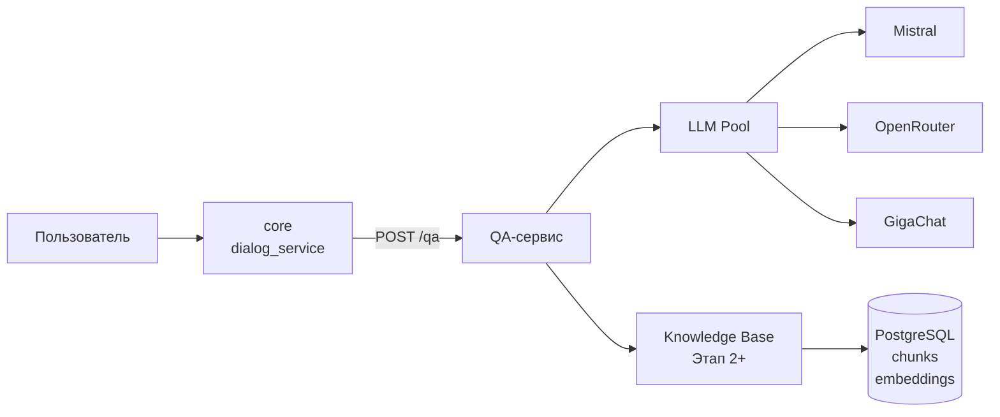
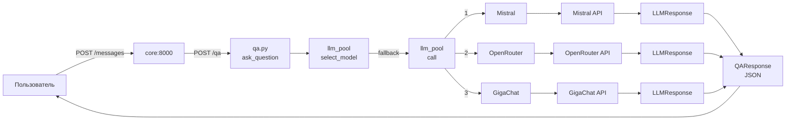

# Путь запроса через QA-сервис

Этот документ описывает, как запрос проходит через QA-сервис от получения вопроса до ответа пользователю.

## Общая схема



## API Endpoints

### POST /qa

Основной endpoint для обработки вопросов.

#### Запрос

```json
{
    "question": "Как поступить на магистратуру?",
    "context": "Контекст (опционально)"
}
```

#### Ответ

```json
{
    "answer": "Для поступления на магистратуру...",
    "model": "open-mistral-nemo",
    "sources": []
}
```

### GET /health

Проверка здоровья сервиса.

#### Ответ

```json
{
    "status": "ok",
    "version": "0.1.0"
}
```

### GET /health/ready

Проверка готовности сервиса (включая LLM провайдеры).

## Компоненты QA-сервиса

### qa-service/src/qa/api/routes/qa.py

#### `ask_question(request: QARequest) -> QAResponse`

Главная функция обработки вопроса.

Что делает:

1. Получает `question` из запроса.
2. Если есть `context`, добавляет его к промпту.
3. Вызывает `llm_pool.call(prompt)`.
4. Возвращает `QAResponse` с ответом от LLM.

### qa-service/src/qa/llm/pool.py

#### `LLMPool`

Пул LLM провайдеров с fallback логикой.

##### `select_model() -> str | None`

Выбирает первую доступную модель по приоритету:

1. Проверяет доступность провайдеров через `is_available()`.
2. Возвращает имя первого доступного провайдера из списка приоритетов.

Приоритет по умолчанию:
```python
model_priority = ["mistral", "openrouter", "giga"]
```

##### `call(prompt: str, provider_name: str | None = None) -> LLMResponse`

Вызывает LLM с fallback логикой.

Что делает:

1. Если указан `provider_name`, использует только его.
2. Иначе перебирает провайдеров по порядку приоритета.
3. Для каждого провайдера:
   - Проверяет доступность через `is_available()`.
   - Вызывает `provider.generate()`.
   - Если успешно — возвращает ответ.
   - Если ошибка — пробует следующий провайдер.
4. Если все провайдеры упали — выбрасывает `ValueError`.

### qa-service/src/qa/llm/providers/

#### Базовый класс: `BaseLLMProvider`

Интерфейс для всех провайдеров.

Методы:

- `name: str` — имя провайдера
- `generate(prompt, temperature, max_tokens) -> LLMResponse` — генерация ответа
- `is_available() -> bool` — проверка доступности

#### MistralProvider

```python
model = "open-mistral-nemo"
endpoint = "https://api.mistral.ai/v1/chat/completions"
```

#### OpenRouterProvider

```python
model = "openrouter/free"
endpoint = "https://openrouter.ai/api/v1/chat/completions"
```

#### GigaChatProvider

```python
model = "GigaChat"
endpoint = "https://ngw.devices.sberbank.ru:9443/api/v2/chat/completions"
```

Требует OAuth аутентификацию с получением токена.

## Модели данных

### qa-service/src/qa/models/request.py

#### `QARequest`

```python
class QARequest(BaseModel):
    question: str  # Вопрос пользователя (1-10000 символов)
    context: str | None  # Дополнительный контекст
```

#### `QAResponse`

```python
class QAResponse(BaseModel):
    answer: str  # Ответ от LLM
    model: str  # Использованная модель
    sources: list[str]  # Источники из БЗ (будут добавлены)
```

## Конфигурация

### Переменные окружения

```bash
# LLM Providers
MISTRAL_API_KEY=your_mistral_key
OPENROUTER_API_KEY=your_openrouter_key
GIGACHAT_CLIENT_ID=your_gigachat_client_id
GIGACHAT_CLIENT_SECRET=your_gigachat_client_secret

# QA Service
QA_SERVICE_URL=http://qa-service:8004

# Database
POSTGRES_HOST=postgres
POSTGRES_DB=voproshalych
POSTGRES_USER=voproshalych
POSTGRES_PASSWORD=voproshalych
```

### Приоритет моделей

По умолчанию: `mistral -> openrouter -> gigachat`

Изменить можно через переменную `MODEL_PRIORITY` (список провайдеров через запятую).

## Итоговый путь запроса



## Расширение функциональности

### Добавить новый LLM провайдер

1. Создать класс в `qa/llm/providers/new_provider.py`:
   ```python
   class NewProvider(BaseLLMProvider):
       @property
       def name(self) -> str:
           return "new_provider"
       
       async def generate(...) -> LLMResponse:
           ...
       
       def is_available(self) -> bool:
           return bool(self._api_key)
   ```

2. Добавить в `qa/llm/pool.py` в `_init_providers()`.

### Добавить Knowledge Base (Этап 2)

После реализации БЗ:

1. В `ask_question()` добавить поиск по БЗ перед вызовом LLM.
2. Сформировать промпт с контекстом из чанков.
3. Добавить источники в `QAResponse.sources`.

## Краткое резюме

- QA-сервис принимает вопрос от core
- LLM Pool выбирает доступный провайдер
- При ошибке — fallback на следующий провайдер
- Возвращает ответ в формате QAResponse
