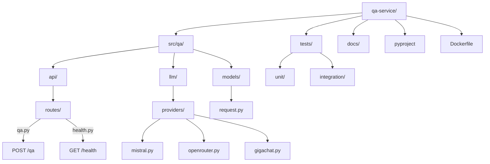

# Тестирование и запуск QA-сервиса

## Локальная разработка

### Предварительные требования

- Python 3.12+
- UV (менеджер пакетов)

### Установка зависимостей

```bash
cd qa-service
uv sync
```

### Запуск сервиса локально

```bash
# С переменными окружения
MISTRAL_API_KEY=your_key \
OPENROUTER_API_KEY=your_key \
GIGACHAT_CLIENT_ID=your_id \
GIGACHAT_CLIENT_SECRET=your_secret \
uv run uvicorn qa.main:app --host 0.0.0.0 --port 8004
```

Или через Docker:

```bash
docker compose up qa-service
```

### Остановка сервиса

Если запущен через uvicorn — нажми `Ctrl+C` в терминале.

Если запущен через Docker:

```bash
docker compose stop qa-service
```

### Проверка работает ли сервис

```bash
# Health check
curl http://localhost:8004/health

# Тестовый запрос
curl -X POST http://localhost:8004/qa \
  -H "Content-Type: application/json" \
  -d '{"question": "Привет, кто ты?"}'
```

## Запуск тестов

### Все тесты

```bash
cd qa-service
uv run pytest
```

### Только unit-тесты

```bash
uv run pytest tests/unit/
```

### Только интеграционные тесты

```bash
uv run pytest tests/integration/
```

### С покрытием кода

```bash
uv run pytest --cov=src --cov-report=html
```

Отчёт будет в файле `htmlcov/index.html`.

## Тесты

### Unit-тесты

- `tests/unit/test_llm_pool.py` — тесты LLM Pool
  - Инициализация пула
  - Выбор модели
  - Fallback логика
  - Обработка ошибок

- `tests/unit/test_providers.py` — тесты провайдеров
  - Инициализация провайдеров
  - Проверка доступности
  - Создание ответов

### Интеграционные тесты

- `tests/integration/test_qa_api.py` — тесты API
  - Health endpoints
  - QA endpoint
  - Валидация запросов
  - Обработка ошибок

## Docker

### Сборка образа

```bash
cd voproshalych_v2
docker compose build qa-service
```

### Запуск с PostgreSQL

```bash
docker compose up -d postgres qa-service
```

### Логи

```bash
docker compose logs qa-service
```

### Остановка

```bash
docker compose down
```

## Конфигурация

### Переменные окружения

| Переменная | Описание | По умолчанию |
|------------|---------|--------------|
| `MISTRAL_API_KEY` | API ключ Mistral AI | - |
| `MISTRAL_MODEL` | Модель Mistral | `open-mistral-nemo` |
| `OPENROUTER_API_KEY` | API ключ OpenRouter | - |
| `GIGACHAT_CLIENT_ID` | Client ID GigaChat | - |
| `GIGACHAT_CLIENT_SECRET` | Client Secret GigaChat | - |
| `MODEL_PRIORITY` | Порядок провайдеров | `openrouter,gigachat,mistral` |
| `DEFAULT_TEMPERATURE` | Температура LLM | 0.7 |
| `DEFAULT_MAX_TOKENS` | Максимум токенов | 2048 |
| `POSTGRES_HOST` | Хост PostgreSQL | postgres |
| `POSTGRES_DB` | Имя БД | voproshalych |
| `POSTGRES_USER` | Пользователь БД | voproshalych |
| `POSTGRES_PASSWORD` | Пароль БД | voproshalych |

### Приоритет моделей

По умолчанию используется следующий порядок:

1. **OpenRouter** (`google/gemma-3n-e2b-it:free`, `stepfun/step-3.5-flash:free`)
2. **GigaChat** (`GigaChat`)
3. **Mistral** (`open-mistral-nemo`)

При недоступности одного провайдера автоматически переключается на следующий.

## Структура проекта



## Частые проблемы

### Ошибка "No available LLM providers"

Проверьте, что установлены переменные окружения с API ключами:

```bash
echo $MISTRAL_API_KEY
echo $OPENROUTER_API_KEY
```

### Ошибка подключения к PostgreSQL

Убедитесь, что PostgreSQL запущен:

```bash
docker compose ps
docker compose logs postgres
```

### Тесты падают с ошибкой импорта

Убедитесь, что установлены зависимости:

```bash
uv sync
```

## CI/CD

### Пример GitHub Actions

```yaml
name: Tests

on: [push, pull_request]

jobs:
  test:
    runs-on: ubuntu-latest
    steps:
      - uses: actions/checkout@v4
      - uses: actions/setup-python@v5
        with:
          python-version: '3.12'
      - uses: astral-sh/setup-uv@v4
      - run: uv sync
      - run: uv run pytest
```

## Дополнительная информация

- [Message Flow](message-flow.md) — Путь запроса через систему
- [Документация проекта](../docs/) — Общая документация
